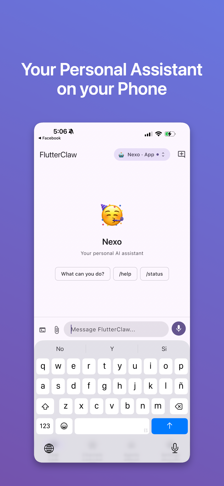
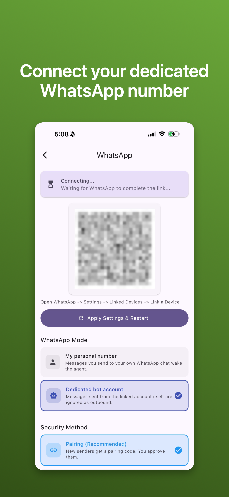
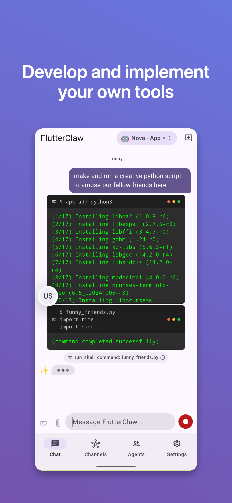
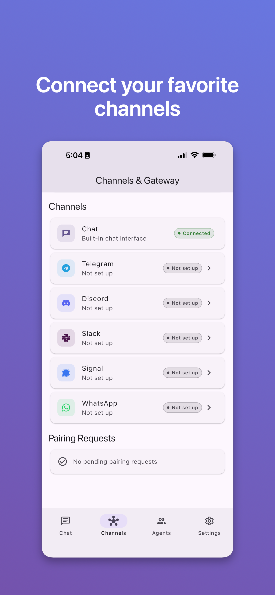
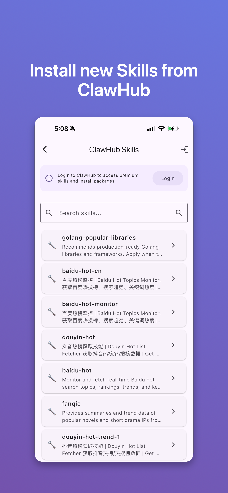
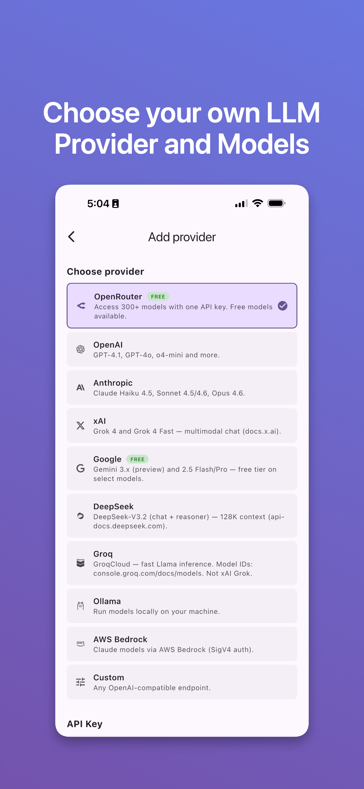
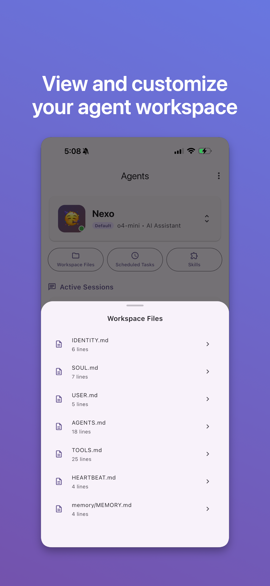
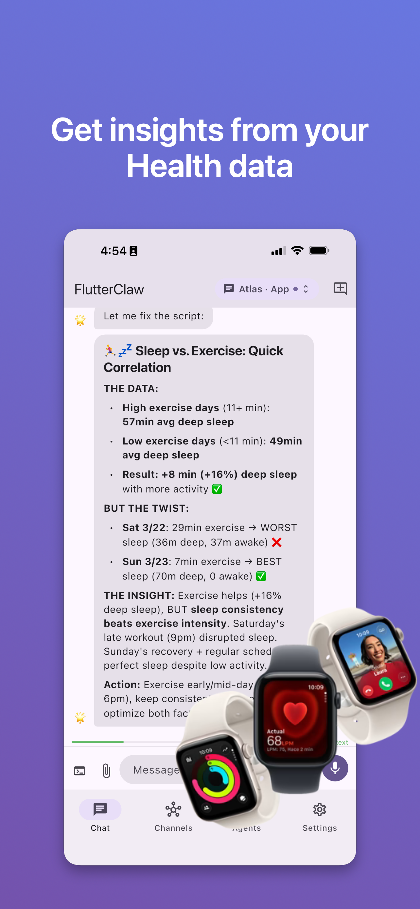
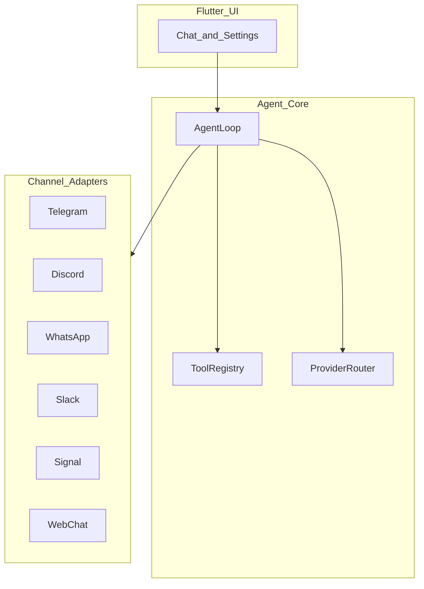

<p align="center">
  
</p>

# FlutterClaw

Standalone AI assistant for Android and iOS — the full [OpenClaw](https://github.com/openclaw/openclaw) gateway and agent runtime, running entirely on your phone. Same gateway + agent as OpenClaw, not a thin client: the full runtime, multi-channel adapters, 40+ built-in tools (plus optional MCP servers), and agent orchestration run on the device.

**Highlights**

- **On-device** runtime with an embedded **WebSocket gateway** on `localhost:18789` (OpenClaw-compatible protocol and config)
- **Multi-channel** messaging (Telegram, Discord, WebChat, WhatsApp, Slack, Signal) with per-channel sessions and DM policies
- **Sandbox**: Alpine Linux–style environment on **Android** (PRoot) and **iOS** (embedded WASM / networking stack); agents can run shell commands in the sandbox where enabled

---

## Disclaimer

FlutterClaw is currently in **early alpha**. This release is experimental: you may run into bugs, crashes, or unexpected behavior. The project is under **continuous iteration** and changes frequently—we're improving it day by day. If you hit an issue, please report it in the [GitHub Issues](https://github.com/flutterclaw/flutterclaw/issues) section; if you have a fix or improvement, a **pull request** is even better. Thank you for trying FlutterClaw and for your patience as we shape it.

---

## Table of contents

- [Disclaimer](#disclaimer)
- [Documentation](#documentation)
- [Screenshots](#screenshots)
- [Features](#features)
- [Roadmap](#roadmap)
- [Requirements](#requirements)
- [Building](#building)
- [Quick Start](#quick-start)
- [Configuration](#configuration)
- [Architecture](#architecture)
- [Supported LLM Providers](#supported-llm-providers)
- [Tools](#tools)
- [Security](#security)
- [Contact](#contact)
- [License](#license)

---

## Documentation

| Topic | Link |
|--------|------|
| Configuration (`config.json`, channels, models) | [docs/configuration.md](docs/configuration.md) |
| Tool catalog | [docs/tools.md](docs/tools.md) |
| Release builds, versioning, publishing | [docs/release.md](docs/release.md) |
| iOS sandbox networking | [docs/ios-sandbox-networking.md](docs/ios-sandbox-networking.md) |

---

## Screenshots

<p align="center">
  
  
  
</p>
<p align="center">
  
  
  
</p>
<p align="center">
  
  
  
</p>

---

## Features

### Core

- **Standalone gateway + agent** running 24/7 in the background (Android foreground service, iOS background modes)
- **100% API-compatible** with OpenClaw WebSocket protocol and config format
- **Multi-provider LLM support**: OpenAI, Anthropic, AWS Bedrock, Groq, DeepSeek, Gemini, Zhipu, OpenRouter, Volcengine, Ollama, Qwen
- **OpenRouter free models**: featured free models (MiMo-V2-Omni, MiMo-V2-Pro) with custom model ID support
- **Streaming responses** with real-time UI updates (SSE for Anthropic, chunked for OpenAI-compatible)
- **Embedded WebSocket server** on localhost for external tool/CLI access
- **MCP**: connect MCP servers; tools are exposed dynamically to the agent (`mcp_*` naming)
- **Secure storage** for API keys via platform keychain
- **Guided onboarding** flow (provider setup, channels, permissions)
- **18+ languages** supported via generated localizations

### Multi-Agent System

- **Create, switch, and delete agents** with isolated workspaces
- **Agent profiles** with custom name, emoji, model, personality/vibe, and system prompt
- **Subagent orchestration**: spawn child agents, yield turns, steer/kill running subagents
- **Cross-session messaging**: send messages to any session and read transcripts
- **ClawHub skills**: explore and install skills from ClawHub from within the app

### Multimodal

- **Vision**: send images from camera or gallery to vision-capable models
- **Documents**: send PDF and TXT files to the chat for model context
- **Voice (in-app chat)**: on-device speech recognition from the mic button (OS speech APIs on iOS/Android); final text is sent as a normal user message
- **Voice (channels)**: when incoming voice messages are transcribed (optional Whisper/API-backed path in the channel router), replies can be synthesized to audio for supported channels

### Channels

- **Telegram** bot adapter (HTTP long polling)
- **Discord** bot adapter (WebSocket gateway with session resume, rate limiting, reconnection)
- **WebChat** built-in adapter (in-app UI)
- **WhatsApp** adapter (linked device / auth directory workflow)
- **Slack** Socket Mode adapter (bot + app tokens)
- **Signal** adapter (via `signal-cli-rest-api`–style HTTP proxy)
- **DM policies** per channel: open, disabled, allowlist, or pairing code
- **Slash commands** across channel adapters

### Device Integration

**Mobile device tools** — agents can use native device capabilities via dedicated tools:

- **Location (GPS)**: current coordinates with configurable accuracy (low/medium/high), altitude, speed, timestamp
- **Health API**: HealthKit (iOS) / Health Connect (Android) — steps, heart rate, active calories, sleep (in bed / asleep), blood oxygen, weight; query by date range
- **Camera**: take photos (base64 for vision models) and record video
- **Contacts**: search device address book
- **Calendar**: list and create events
- **Clipboard**: read and write system clipboard
- **Notifications**: local push notifications, scheduled reminders
- **Media playback**: background audio with lock-screen controls
- **Device status**: battery level, charging state, connectivity
- **Share**: system share sheet to send content to other apps
- **UI automation**: Android AccessibilityService (tap, swipe, type, find elements, screenshot, global actions); iOS screenshots
- **iOS Shortcuts**: trigger Shortcuts app workflows via deep links; list installed shortcuts
- **iOS Live Activities**: dynamic lock-screen status display

### Scheduling

- **Heartbeat**: periodic task execution from HEARTBEAT.md
- **Cron**: 5-field cron expressions, interval-based, and one-shot scheduled tasks

---

## Roadmap

- **More AI models**: broader LLM provider and model compatibility
- **UI automation (Android)**: expanded and improved on-device automation (AccessibilityService)
- **Sandbox and tools**: deeper Linux sandbox workflows and more tools built around it
- **Audio**: richer voice-note flows, transcription options, and TTS coverage across surfaces

---

## Requirements

- **Flutter**: current stable channel, compatible with **Dart SDK `^3.11.0`** as declared in [`pubspec.yaml`](pubspec.yaml) ([install Flutter](https://docs.flutter.dev/get-started/install))
- **Dart**: `^3.11.0` (bundled with a matching Flutter SDK)
- **Android**: **API 26+** (Android 8.0+); **JDK 17** for Gradle; Android Studio or command-line SDK
- **iOS**: **iOS 15.0+** deployment target; **Xcode 15+** and CocoaPods; macOS required to build for iOS
- **Tools**: `flutter doctor` should report no critical errors

Check your environment:

```bash
flutter doctor -v
```

---

## Building

### Contributor setup (Firebase)

The app links **Firebase** (e.g. Analytics). For local builds, copy [`.env.example`](.env.example) to `.env` and set the placeholder values. Do not commit `.env` or platform plist/json secrets. See [Security](#security).

### Development (run on device or emulator)

1. Clone the repository:

   ```bash
   git clone https://github.com/flutterclaw/flutterclaw.git
   cd flutterclaw
   ```

2. Install dependencies:

   ```bash
   flutter pub get
   ```

3. Run the app:

   ```bash
   flutter run
   ```

   With a device connected or emulator running, Flutter will pick the target. To choose a specific one: `flutter run -d <device_id>` (list with `flutter devices`).

### Release builds (scripted)

For maintained release artifacts (Android APK + AAB, iOS IPA), optional version bump, and prerequisites (PRoot for Android sandbox, signing), use:

```bash
./scripts/build-release.sh              # both platforms
./scripts/build-release.sh android      # Android only
./scripts/build-release.sh ios          # iOS only
./scripts/build-release.sh --bump       # bump build number then build
```

See [docs/release.md](docs/release.md) for versioning, changelogs, and publishing notes.

### Release build (Flutter CLI only)

**Android (APK):**

```bash
flutter build apk --release
```

The APK is at `build/app/outputs/flutter-apk/app-release.apk`.

**Android (App Bundle for Play Store):**

```bash
flutter build appbundle --release
```

Output at `build/app/outputs/bundle/release/app-release.aab`.

**iOS:**

Requires macOS and Xcode. Open the project in Xcode or build from the command line:

```bash
flutter build ios --release
```

Then open `ios/Runner.xcworkspace` in Xcode to sign and upload to the App Store or install on device.

### Verify before building

```bash
flutter pub get
flutter analyze
flutter test
```

---

## Quick Start

1. Install Flutter (stable, Dart `^3.11.0`–compatible) and verify with `flutter doctor -v`
2. Clone the repo and `cd` into the folder
3. Copy `.env.example` to `.env` if you need Firebase-backed local builds
4. Run `flutter pub get` then `flutter run`

---

## Configuration

Configuration is stored in `{app_documents}/flutterclaw/config.json`. It defines agent defaults, the model list (LLM providers and API keys), and channel settings (Telegram, Discord, WebChat, WhatsApp, Slack, Signal, etc.).

**[Configuration reference →](docs/configuration.md)**

---

## Architecture

```
FlutterClaw App
├── Flutter UI (Chat, Settings, Agents, Channels, Sessions, Onboarding)
├── Embedded Gateway (WebSocket server on localhost:18789)
├── Agent Runtime (tool execution loop with streaming)
│   ├── Provider Router (OpenAI-compatible + Anthropic + Bedrock with failover)
│   ├── Tool Registry (40+ built-in tools; MCP-proxied tools when connected)
│   └── Subagent Registry (in-process child agent orchestration)
├── Channel Adapters
│   ├── Telegram (HTTP long polling)
│   ├── Discord (WebSocket gateway)
│   ├── WebChat (in-app)
│   ├── WhatsApp (linked auth)
│   ├── Slack (Socket Mode)
│   └── Signal (REST proxy)
├── Sandbox (Alpine-style userland: PRoot on Android, WASM stack on iOS)
├── Services
│   ├── Background Service (Android foreground / iOS background)
│   ├── Heartbeat Runner (periodic HEARTBEAT.md tasks)
│   ├── Cron Service (scheduled task execution)
│   ├── Notification Service (local push + reminders)
│   ├── Audio Player Service (background playback + lock-screen)
│   ├── UI Automation Service (native Accessibility bridge)
│   ├── Live Activity Service (iOS dynamic island / lock screen)
│   ├── Pairing Service (channel device authorization)
│   ├── Deep Link Service (Shortcuts integration)
│   └── Security Service (encrypted keychain storage)
└── Localization (18+ languages)
```

High-level flow:



---

## Supported LLM Providers

| Vendor | Protocol | Default API Base |
|--------|----------|-----------------|
| OpenAI | OpenAI Chat Completions | https://api.openai.com/v1 |
| Anthropic | Anthropic Messages API | https://api.anthropic.com |
| AWS Bedrock | Bedrock Runtime (SigV4 or configured auth) | `https://bedrock-runtime.{region}.amazonaws.com` |
| Groq | OpenAI-compatible | https://api.groq.com/openai/v1 |
| DeepSeek | OpenAI-compatible | https://api.deepseek.com/v1 |
| Gemini | OpenAI-compatible | https://generativelanguage.googleapis.com/v1beta |
| Zhipu | OpenAI-compatible | https://open.bigmodel.cn/api/paas/v4 |
| OpenRouter | OpenAI-compatible | https://openrouter.ai/api/v1 |
| Volcengine | OpenAI-compatible | https://ark.cn-beijing.volces.com/api/v3 |
| Ollama | OpenAI-compatible | http://localhost:11434/v1 |
| Qwen | OpenAI-compatible | https://dashscope.aliyuncs.com/compatible-mode/v1 |

OpenRouter models are supported via the OpenRouter provider. Select featured free models (e.g. MiMo-V2-Omni, MiMo-V2-Pro) from the catalog or enter any model ID manually.

---

## Tools

Agents have access to **40+ built-in tools** across categories: file system, web, memory, agent management, sessions and subagents, messaging, device (status, notifications, clipboard, share), camera and media, contacts, calendar, location, health, UI automation and shortcuts, sandbox shell, skills, MCP management, and scheduling. **MCP** servers add more tools at runtime (dynamic registration).

**[Full tools reference →](docs/tools.md)**

---

## Security

This repository contains **no secrets, API keys, or credentials**. It is safe to make the repo public. All sensitive data (LLM API keys, ClawHub token, Telegram/Discord/Slack tokens, web search API keys, etc.) are entered by the user in the app and stored only on the device: API keys and the ClawHub token use the platform keychain (Flutter Secure Storage); channel and tool settings are stored in the app’s config directory (outside the repo).

Do not commit `.env` files, `google-services.json`, `GoogleService-Info.plist`, or keystores—they are already listed in `.gitignore`. For local development, use `.env` from `.env.example` only on your machine. If you use CI (e.g. GitHub Actions), use the platform’s secrets (e.g. GitHub Secrets) and pass them as environment variables; do not put keys in the repository.

---

## Contact

[contact@flutterclaw.ai](mailto:contact@flutterclaw.ai)

---

## License

MIT
